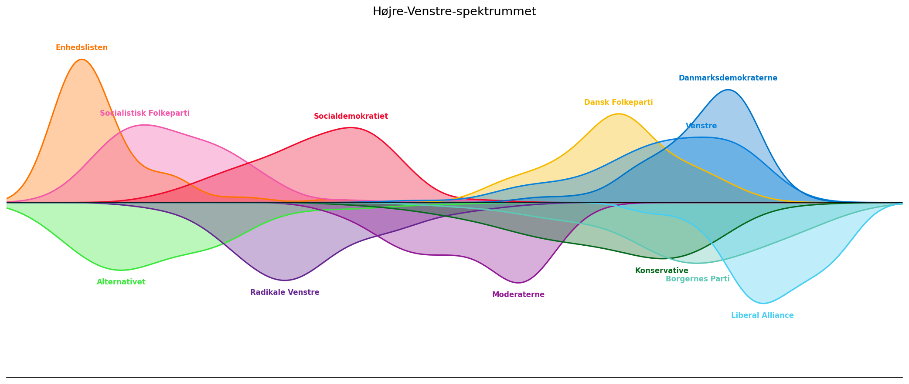

## Indledning
Så blev fødevarechecken godkendt af Folketinget og med udsigten til at sende penge direkte ud til (mere eller mindre) 
trængende vælgere besluttede statsministeren omgående at udskrive valg.
Heldigvis var journalisterne klar, så ikke længe efter kunne man tage den tilbageværende Kandidattest hos DR og 
Altinget, som giver en nem måde at føle sig politisk oplyst på. Men den giver også et indblik i holdningerne hos de 
hundredevis af personer der i denne omgang kandidere til en plads i Folketinget, og hvorfor ikke udnytte det til lidt 
politisk analyse, som måske stadig er ment som en form som underholding, men med forhåbning om at det også bliver en 
analese mere oplysende end hvad Morten Messerschmidt putter i sin kødsovs.

## Den klassiske akse
[Siden Den Franske Revolution](https://lex.dk/venstre-h%C3%B8jre-kontinuet) har de politiske partier været opdelt på et højre-venstre kontinum, så det er nærliggende at prøve at placere kandidaterne på en enkelt akse. Der er dog sket en del siden syttenhundredetallet og én enkelt dimension viser sig måske at være lige det mindste for at udtrykke nuancerne mellem partierne, men det er et sted at starte. Siden den klassiske akse især har været bundet til (om)fordeling af goderne tager vi her udgangspunkt i de spørgsmål der har med økonomi og velfærd at gøre[^1]. Ved at projektere alle kandidaternes svar på ind den retning hvor der er størst variation får vi nedenstående overblik over partiernes placering.
 
[^1]: Kategorierne SKAT OG AFGIFTER, ØKONOMI OG ARBEJDSMARKED samt SOCIAL OG ULIGHED

## Det politiske landkort

<iframe src="map.html" scrolling="no" title="Geografisk fordeling af partistøtte"></iframe>

<iframe src="ekstrem.html" scrolling="no" title=""></iframe>

